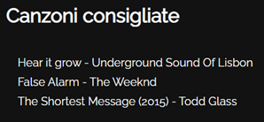

## Dataset

Il dataset utilizzato è disponibile al seguente [link](https://www.kaggle.com/datasets/yamaerenay/spotify-dataset-19212020-600k-tracks)

Il dataset contiene più di 600.000 tracce musicali di Spotify e i
dati di oltre 1 milione di artisti.

Per poter utilizzare al meglio il dataset è necessario svolgere
alcune operazioni per pulire i dati.

## Data Preparation

Alcune feature del dataset non sono prontamente utilizzabili.
Per esempio, **release_date** è una stringa che può essere trasformata nella decade della canzone.
Inoltre, il dataset non offre informazioni sul genere di una canzone; tuttavia, sono associati dei generi per gli artisti.
Questo permette di ricavare il genere di una canzone in base all’artista.

## Feature del dataset

Le feature più importanti del dataset sono quelle che rappresentano aspetti principali delle canzoni:

**Variabili numeriche**

- **Acousticness**: variabile da 0 a 1, rappresenta quanto sia acustica la canzone
- **Danceability**: variabile da 0 a 1, rappresenta quanto sia ballabile la canzone
- **Energy**: variabile da 0 a 1, rappresenta l’energia della canzone
- **Duration_ms**: variabile da 200k a 300k, durata della canzone
- **Instrumentalness**: variabile da 0 a 1, rapporto della parte della canzone identificata come strumentale
- **Valence**: variabile da 0 a 1, rappresenta la positività della canzone
- **Popularity**: variabile da 0 a 100, popolarità della canzone negli USA
- **Tempo**: variabile da ~50 a 150, tempo della traccia in BPM
- **Liveness**: variabile da 0 a 1, rapporto della parte della canzone identificata come live performance
- **Loudness**: variabile da -60 a 0, valore decibel (dB)
- **Speechiness**: variabile da 0 a 1, rapporto della parte della canzone in cui viene identificata la presenza di voce umana
- **Year**: variabile da 1921 a 2020, anno della canzone

**Variabili categoriche**

- **Key**: Chiave della canzone rappresentata come un intero tra 0 e 11, partendo dal Do
- **Artists**: Lista degli artisti presenti nella canzone
- **Name**: Titolo della canzone
- **Mode**: Valore binario che rappresenta se la canzone inizi con una progressione di accordi minore o maggiore
- **Explicit**: Valore binario che rappresenta se la canzone contenga contenuti espliciti o meno

## Funzionalità del programma

Le funzionalità principali del programma sono:

- Raccomandazione di un insieme di canzoni in base all’analisi della playlist inserita dall’utente
- Classificazione del genere di una canzone inserita dall’utente
- Raccomandazione di canzoni simili a quella inserita dall’utente

L’approccio utilizzato per la raccomandazione di una playlist è il **TF-IDF** (Term Frequency – Inverse Document Frequency).
Con il TF-IDF è possibile dare più o meno peso ai metadata sul genere a seconda di quanto spesso determinati generi compaiono nel dataset.
Una volta generato un set di feature basandosi sul TF-IDF, è possibile rappresentare ogni canzone in una playlist come un vettore di features.
È possibile dunque utilizzare la **cosine similarity** per individuare canzoni che sono simili alla playlist analizzata.

### Analisi di una playlist

Una volta fornito l’URL della playlist che si vuole analizzare,
il programma genera un’altra playlist con canzoni che sono simili al vettore che rappresenta la playlist.

### Analisi di una canzone

Per la classificazione del genere di una canzone è stato necessario semplificare il dataset,
in quanto contenente molti generi con pochi esempi oppure esempi senza alcun genere.
Raccogliendo solo i **20 generi** più rappresentati, il totale delle tracce si attesta sui 350.000.

Il programma mostra le percentuali di probabilità del genere, ordinate in modo decrescente.
Oltre a classificare il genere della canzone,
il programma fornisce dei suggerimenti in base alla canzone analizzata.
Per generare i suggerimenti viene utilizzato l’apprendimento non supervisionato,
in particolare vengono consigliate canzoni che appartengono allo stesso cluster della canzone analizzata.
I cluster vengono generati utilizzando **k-means clustering**, con k = 1000.

## Bayesian Belief Network

Oltre ai modelli di classificazione implementati con Sklearn,
è stato implementata una Belief Network utilizzando pybbn.
Il modello della Belief Network è il seguente:

Il modello è stato costruito utilizzando alcune assunzioni elementari.
Ad esempio, la **valence** di una canzone rappresenta quanto sia allegra,
per questo motivo **key** e **mode** (rispettivamente chiave e tonalità della canzone) sono due feature ritenute rilevanti,
poiché una canzone con una tonalità minore, piuttosto che maggiore, sarà generalmente considerata più triste.
Lo stesso vale per **loudness**, **energy**, **tempo** e **danceability**, intuitivamente canzoni più forti ed energiche, con un tempo incalzante, saranno, generalmente, più ballabili.

## Statistiche dei classificatori

I modelli di apprendimento supervisionato usati per la classificazione sono:

- **Logistic Regression**:
  Modello di classificazione che punta a minimizzare log-loss per determinare i pesi di una funzione lineare

- **Neural Networks**:
  È stata utilizzata una rete neurale di tipo MLPC (Multi-layer Perceptron Classifier), che punta a minimizziare la log-loss.

- **Random Forest e GradientBoosting**:
  Algoritmi di ensemble learning che generano più learner (alberi) per effettuare predizioni, unendoli alla fine per ottenere il classificatore.

- **Decision Tree**:
  Algoritmo che determina delle regole per un albero di decisione analizzando i dati ad esso forniti.

- **Gaussian NB**:
  Versione dell’algoritmo Naive Bayes che da per scontato che la probabilità delle feature sia gaussiana.

Le statistiche sui classificatori sono state valutate utilizzando **metrics** di sklearn.
Inoltre, per ogni classificatore è stata effettuata **cross validation** con 10 folds.

| Metric                 | Decision Tree | Gradient Boosting | Logistic Reg. | Neural Network | Random Forest | Naive Bayes |
| ---------------------- | ------------- | ----------------- | ------------- | -------------- | ------------- | ----------- |
| Accuracy               | 0.552         | 0.473             | 0.511         | 0.416          | 0.489         | 0.301       |
| Missclasificaiton rate | 0.447         | 0.526             | 0.488         | 0.583          | 0.510         | 0.698       |
| Precision score        | 0.494         | 0.413             | 0.455         | 0.419          | 0.443         | 0.351       |
| Recall score           | 0.552         | 0.473             | 0.511         | 0.416          | 0.489         | 0.301       |

**10 Folds Cross Validation**

| Model | 1     | 2     | 3     | 4     | 5     | 6     | 7     | 8     | 9     | 10    |
| ----- | ----- | ----- | ----- | ----- | ----- | ----- | ----- | ----- | ----- | ----- |
| DT    | 0.533 | 0.620 | 0.572 | 0.594 | 0.574 | 0.596 | 0.581 | 0.597 | 0.586 | 0.590 |
| GB    | 0.423 | 0.428 | 0.424 | 0.432 | 0.435 | 0.431 | 0.427 | 0.434 | 0.434 | 0.434 |
| LR    | 0.403 | 0.403 | 0.424 | 0.431 | 0.403 | 0.431 | 0.403 | 0.433 | 0.403 | 0.403 |
| NN    | 0.427 | 0.462 | 0.440 | 0.456 | 0.444 | 0.453 | 0.449 | 0.463 | 0.457 | 0.457 |
| RF    | 0.538 | 0.617 | 0.559 | 0.576 | 0.564 | .0591 | 0.575 | 0.592 | 0.574 | 0.580 |
| NB    | 0.437 | 0.494 | 0.460 | 0.475 | 0.471 | 0.489 | 0.488 | 0.505 | 0.486 | 0.495 |
